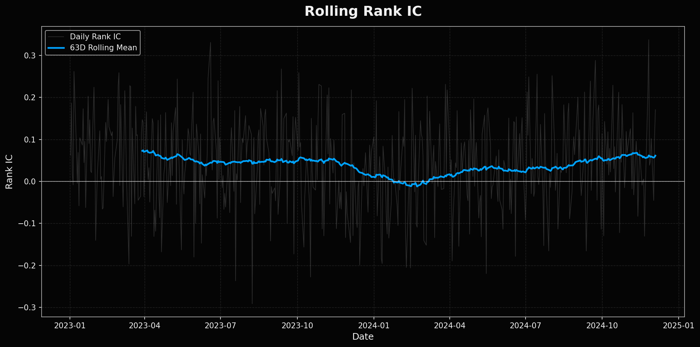
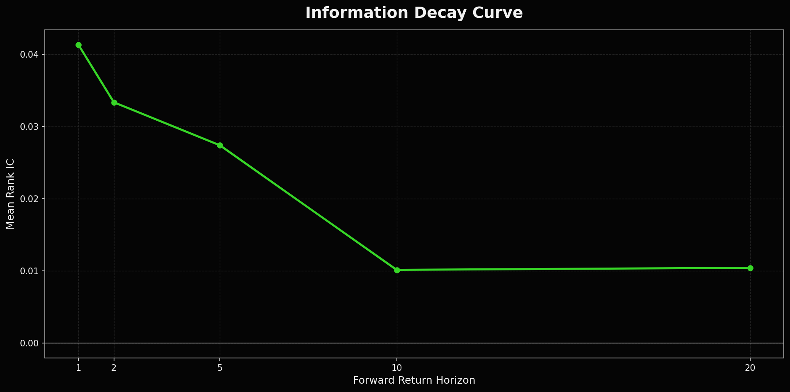
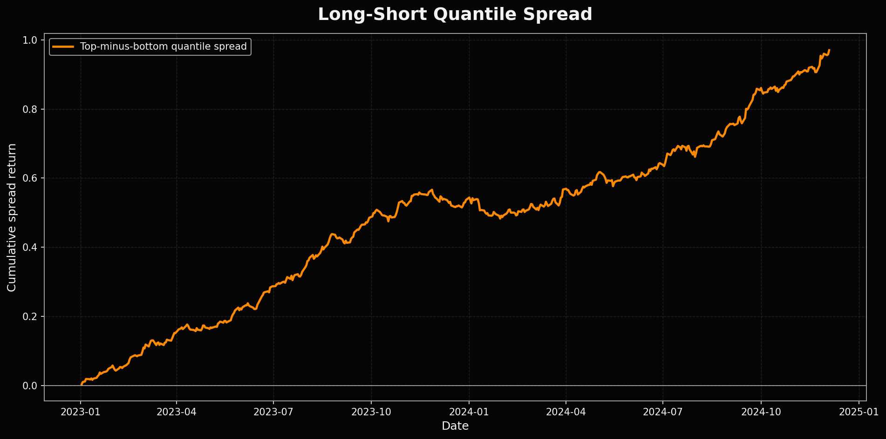
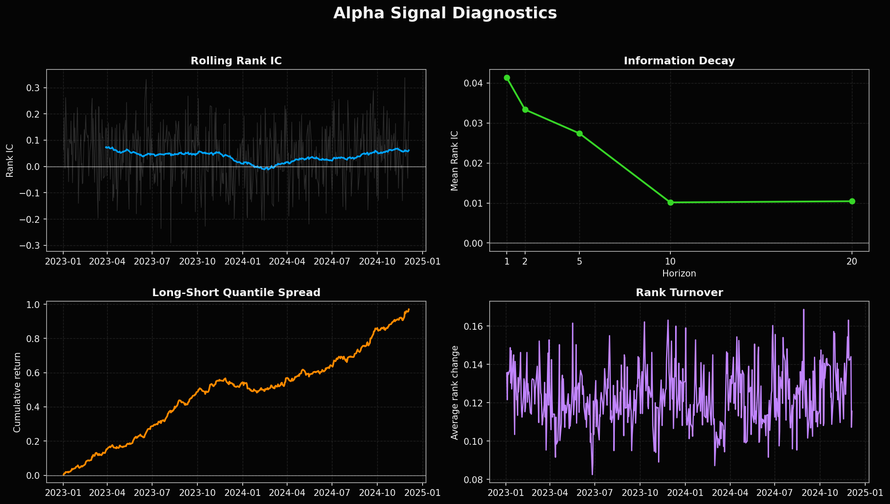

# Alpha Diagnostics Lab

A quantitative research project for evaluating alpha signal quality, robustness, and decay.

This project focuses on the **research layer before portfolio construction**:

> Does the alpha signal actually contain information?

Instead of presenting a trading strategy, the repository builds a clean diagnostic framework around synthetic market data and alpha scores. The goal is to test whether a signal is persistent, directionally useful, robust across time, and economically interpretable before it is translated into portfolio weights.

---

## Project Scope

The workflow is intentionally focused on alpha validation:

1. Simulate synthetic asset returns and alpha scores
2. Measure cross-sectional **Rank IC**
3. Test **information decay** across multiple forward horizons
4. Evaluate **long-short quantile spread** behavior
5. Estimate signal stability through **turnover diagnostics**
6. Summarize results in a compact research report

The data is synthetic by design. The objective is not to claim a live trading edge, but to demonstrate a reproducible quantitative research process.

---

## Core Diagnostics

### 1. Rank Information Coefficient

Rank IC measures whether higher-ranked securities by signal tend to achieve higher future returns.

```text
RankIC_t = SpearmanRankCorr(signal_t, forward_return_{t+1})
```

This is a common first-pass test for cross-sectional alpha quality.

### 2. Information Decay

A useful signal should have a measurable relationship with future returns, but that relationship usually weakens over longer horizons.

The project evaluates Rank IC at multiple horizons:

```text
1d, 2d, 5d, 10d, 20d
```

### 3. Long-Short Quantile Spread

Assets are sorted into signal quantiles. The spread between the top and bottom signal buckets provides a simple economic interpretation of the signal.

```text
Spread_t = mean(return_top_quantile) - mean(return_bottom_quantile)
```

### 4. Turnover and Signal Stability

A signal can look attractive but still be difficult to implement if rankings change too aggressively. The project measures rank turnover as a proxy for stability.

---

## Example Outputs

### Rolling Rank IC



### Information Decay



### Long-Short Quantile Spread



### Signal Diagnostics Dashboard



---

## Repository Structure

```text
alpha-diagnostics-lab/
├── README.md
├── requirements.txt
├── pyproject.toml
├── run_analysis.py
├── src/
│   └── alpha_diagnostics/
│       ├── __init__.py
│       ├── simulate.py
│       ├── diagnostics.py
│       ├── plotting.py
│       └── report.py
├── tests/
│   └── test_diagnostics.py
├── notebooks/
│   └── alpha_diagnostics_walkthrough.ipynb
├── data/
│   ├── alpha_scores.csv
│   ├── simulated_returns.csv
│   ├── rank_ic.csv
│   ├── information_decay.csv
│   ├── quantile_returns.csv
│   ├── quantile_spread.csv
│   ├── turnover.csv
│   └── summary_metrics.csv
├── figures/
│   ├── rolling_rank_ic.png
│   ├── information_decay.png
│   ├── quantile_spread.png
│   └── signal_diagnostics_dashboard.png
├── assets/
│   └── social_preview.png
└── reports/
    └── alpha_diagnostics_summary.md
```

---

## Quick Start

Clone the repository and install the dependencies:

```bash
pip install -r requirements.txt
```

Run the full analysis:

```bash
python run_analysis.py
```

This creates updated files in:

- `data/`
- `figures/`
- `reports/`

Run tests:

```bash
pytest
```

---

## Current Research Interpretation

The synthetic signal shows a positive average Rank IC, a clear decay profile over longer horizons, and a constructive long-short quantile spread. This is the type of diagnostic evidence one would want before moving into portfolio construction.

The result should not be interpreted as a live investment strategy. It is a research framework for testing alpha signals under controlled conditions.

---

## Next Steps

Potential extensions:

- Add sector-neutral Rank IC
- Add transaction cost sensitivity
- Add regime-level diagnostics
- Add bootstrap confidence intervals
- Add factor exposure checks
- Connect the validated signal to a portfolio construction layer

---

## Related Project

This project pairs naturally with **Signal-to-Portfolio**:

```text
Alpha Diagnostics Lab  →  validates signal quality
Signal-to-Portfolio   →  translates alpha scores into portfolio weights
```

Together they form a compact research pipeline from alpha validation to portfolio construction.
